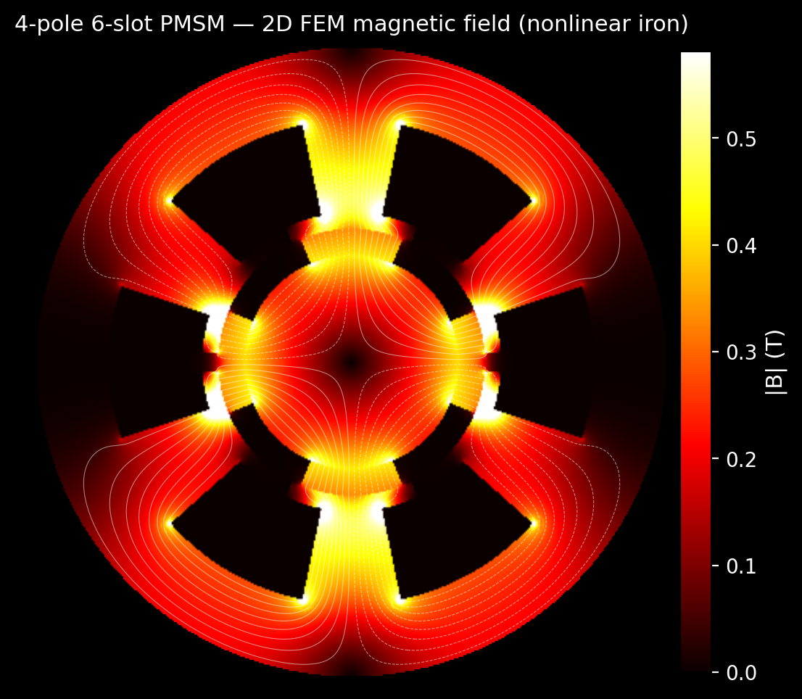
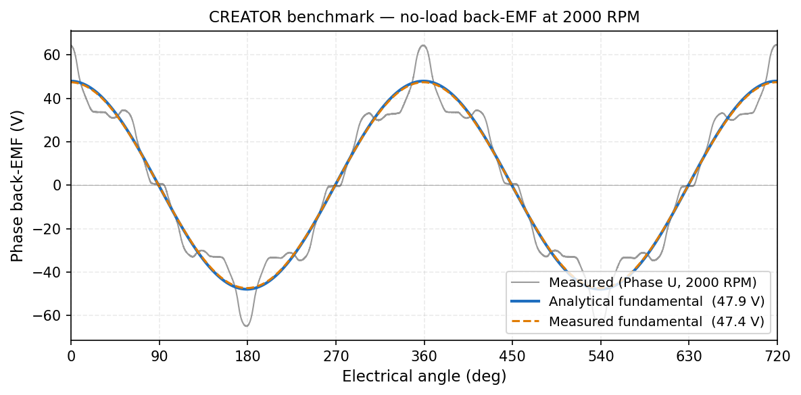
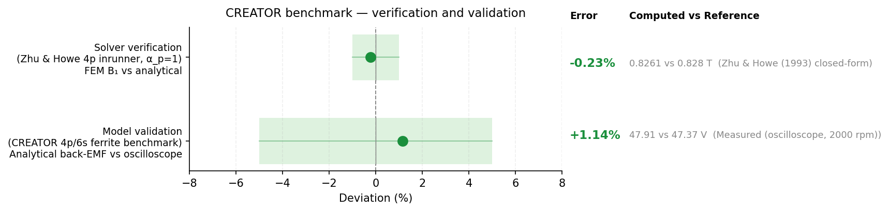

# phasesweep

PMSM simulation for stator/rotor design exploration. Built on
[motulator](https://github.com/Aalto-Electric-Drives/motulator) and
[NGSolve](https://ngsolve.org/).



## What it does

- **Drive simulation** — SPMSM and IPMSM comparison using motulator (current-vector control, mechanical load)
- **2D FEM field solver** — NGSolve magnetostatic solver with smooth-bore and slotted stator geometries, linear or nonlinear iron (Picard iteration)
- **Analytical validation** — Zhu & Howe (2002) closed-form air-gap field model for cross-checking FEM results
- **Slotted stator analysis** — OCC boolean geometry for exact arc-bounded slots, armature reaction decomposition, smooth-vs-slotted comparison
- **Parameter sweeps** — explore the flux-linkage (psi_f) vs saliency-ratio (L_q/L_d) design space with crash-safe JSONL result storage
- **Sensitivity analysis** — perturbation sweeps over geometry and material parameters (OD, gap, L_stk, B_rem) with parallel execution
- **Cross-validation CLI** — import measured data and compare against computed results across multiple motors
- **GPU-accelerated harmonic decomposition** — CuPy FFT on CUDA (optional, falls back to NumPy)

## Verification and validation

### Solver verification (Zhu & Howe)

The NGSolve FEM solver is verified against the Zhu & Howe (2002) closed-form
air-gap field solution. The fundamental agrees within 1% on the Zhu & Howe
reference configurations and within 2% across the other tested inrunner and
outrunner configurations (test-enforced bounds), confirming that the code
solves the magnetostatic equations correctly.

### Model validation (CREATOR benchmark)

Cross-checked against the [CREATOR](https://doi.org/10.3217/sns1d-77m43)
open-benchmark PMSM (70 W, 4-pole, 6-slot, sintered ferrite — Dhakal et
al., COMPEL 2025):

| Test | Computed | Published | Error |
|------|----------|-----------|-------|
| Back-EMF (E_0) | 47.91 V | 47.37 V | 1.1% |
| Rated torque (MTPA at I_rated) | 0.107 Nm | 0.100 Nm | 6.8% |
| Max torque (MTPA at I_max) | 0.157 Nm | 0.150 Nm | 4.7% |



The analytical model captures the back-EMF fundamental to within 1.1%.
The trapezoidal measured waveform reflects the near-rectangular ferrite
magnets — consistent with the square-wave magnetization convention both
solvers use; the analytical comparison is fundamental-only because the
analytical waveform output does not yet include the higher spatial
harmonics.



## Quick start

```bash
git clone https://github.com/jonelay/phase-sweep.git
cd phase-sweep
python -m venv .venv
.venv/bin/pip install -e ".[test]"

# Optional: GPU support (requires CUDA 12.x)
.venv/bin/pip install -e ".[gpu]"

# Run tests
.venv/bin/python -m pytest tests/

# CLI entry points
phasesweep-import --help
phasesweep-crossval --output-dir output --plot
```

Or with [uv](https://docs.astral.sh/uv/):

```bash
uv venv .venv --python 3.12
uv pip install -e ".[test]"
uv run pytest tests/
```

Compute the air-gap field of a motor defined in TOML:

```python
from phasesweep import MODEL_REGISTRY, RunConfig, load_motor

motor = load_motor("motors/creator_case_pmsm.toml")
cfg = RunConfig(motor=motor, model="analytical", n_theta=720)
metrics = MODEL_REGISTRY["analytical"].fn(cfg)
print(metrics["backemf_fundamental"])  # V peak, at rated speed
```

The TOML format (sections, fields, units, defaults) is documented in
[docs/motor-toml.md](docs/motor-toml.md).

## Project structure

```
phasesweep/
├── motor.py          # Motor frozen dataclass (composes Geometry + electrical/winding/material)
├── geometry.py       # Geometry dataclass, inrunner/outrunner factories, OCC mesh builder
├── configs.py        # TOML loader (load_motor, load_motors)
├── registry.py       # MODEL_REGISTRY: model metadata, solver dispatch
├── solver_params.py  # Validated solver param types (AnalyticalParams, FemParams, DriveSimParams)
├── defaults.py       # Default parameter values (loaded from defaults.toml)
├── fem_field.py      # NGSolve 2D FEM solver + harmonic decomposition
├── sim.py            # Drive simulation (motulator), sweep orchestration
├── rated_torque.py   # Rated/stall torque models, MTPA curves (Morimoto quadratic)
├── crossval.py       # Cross-validation framework (delta, bound, curve, key_mapping)
├── cli_crossval.py   # CLI: compare computed vs measured across motors
├── cli_import.py     # CLI: import measured data into the result store
├── measured.py       # MeasuredResult schema, import helpers
├── perturbation.py   # Perturbation sweep definitions and parameter deltas
├── parallel.py       # Parallel job execution with progress tracking
├── sweep_types.py    # RunConfig, RunResult frozen dataclasses
├── result_store.py   # JSONL append-only store with crash-safe index
├── geo_sweep.py      # Geometry sweep grid generation
├── plots.py          # Plotting functions (geometry-aware, output_dir parameter)
├── sim_runner.py     # Subprocess runner for motulator (60s timeout)
└── fem_runner.py     # Subprocess runner for NGSolve (300s timeout)
scripts/              # Validation report, sensitivity analysis
tests/                # pytest (617 tests)
data/                 # Reference data (CREATOR, Belkhadir, Awan, Deylami) + own lab measurements
motors/               # Motor parameter files (TOML)
```

## Dependencies

| Package | Purpose | License |
|---------|---------|---------|
| [motulator](https://github.com/Aalto-Electric-Drives/motulator) | Synchronous machine drive simulation | MIT |
| [NGSolve](https://ngsolve.org/) | 2D finite element field solver | LGPL-2.1 |
| [NumPy](https://numpy.org/) | Numerical computation | BSD-3-Clause |
| [Matplotlib](https://matplotlib.org/) | Plotting | PSF (BSD-compatible) |
| [CuPy](https://cupy.dev/) (optional) | GPU-accelerated harmonic decomposition | MIT |

## Reference data

The `data/creator_case_pmsm/` directory contains reference data from the
**CREATOR** open-benchmark PMSM (Dhakal et al., 2025), licensed under
**CC BY-NC-ND 4.0**. See [`data/creator_case_pmsm/README.md`](data/creator_case_pmsm/README.md)
for full attribution and citation info.

## License

Code is licensed under the [LGPL-2.1](LICENSE).

Files in `data/creator_case_pmsm/` derived from the CREATOR dataset are
licensed under
[CC BY-NC-ND 4.0](https://creativecommons.org/licenses/by-nc-nd/4.0/) —
see [`data/creator_case_pmsm/README.md`](data/creator_case_pmsm/README.md).
Other data files contain parameter values transcribed from the cited
publications, or our own lab measurements, and are covered by the MIT
license.
