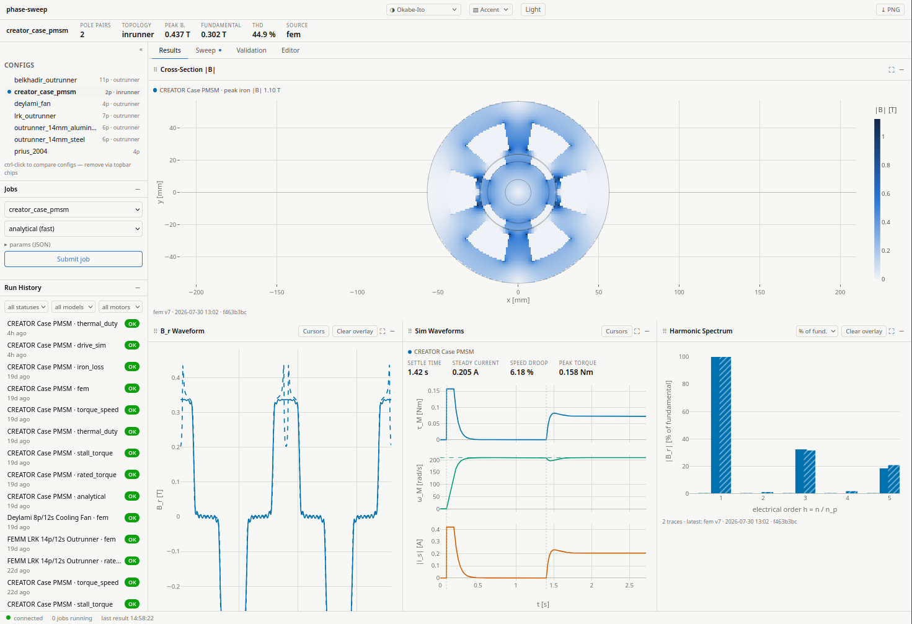

# phase-sweep

PMSM simulation for stator/rotor design exploration. Built on
[motulator](https://github.com/Aalto-Electric-Drives/motulator) and
[NGSolve](https://ngsolve.org/).



## What it does

phase-sweep takes a PMSM defined in TOML and runs it through two
independent air-gap field solvers (Zhu & Howe 2002 closed-form and
NGSolve 2D FEM with nonlinear iron) that solve the same motor and can be
compared directly. Circuit-parameter models add torque-speed envelopes,
drive simulation (motulator), and thermal modeling from datasheet values
alone, no geometry required. The repo includes 23 reference motors
across 13 sources, geometry sweeps, and a browser dashboard for running
jobs and comparing results against imported measurements. Every result is
hashed against its inputs into an append-only JSONL store.

## Features

**Field solvers**
- Zhu & Howe (2002) closed-form air-gap field — inrunner and outrunner
- NGSolve 2D FEM — smooth-bore and slotted stators (OCC boolean geometry, exact arc-bounded slots), linear or nonlinear iron (Picard iteration), armature reaction, Maxwell-stress torque
- Cogging torque via FEM rotation sweep; demagnetization screen at a specified fault current
- Spatial-FFT harmonic decomposition (optional CuPy GPU path, falls back to NumPy)

**Circuit-parameter models**
- MTPA rated torque, stall torque, torque-speed envelope with field weakening (continuous and peak)
- Thermal-duty screen — copper-loss S1 budget over a torque-time duty profile, R_s derated to winding temperature. Deliberately optimistic (no AC/iron/magnet losses), so a failing verdict is decisive and a passing one is not
- Bertotti two-term iron loss

**Drive simulation**
- motulator current-vector control transients, single-mass or two-mass (compliant shaft) load

**Sweeps and validation**
- Geometry and parameter sweeps with parallel execution and crash-safe JSONL result storage
- Perturbation-based sensitivity analysis (OD, gap, L_stk, B_rem, ...)
- Cross-validation framework: import measured data, compare against computed results across motors
- Single-parameter calibration against measured quantities

**Dashboard**
- Local FastAPI server + browser dashboard: queue solver jobs, watch progress live, plot stored waveforms and envelopes, edit motor configs

**Documentation:**
[motor TOML format](docs/motor-toml.md) |
[architecture](docs/architecture.md) |
[validation report](docs/validation-report.md) |
[result-store contract](docs/result-store-contract.md) |
[glossary](docs/glossary.md) |
[references](docs/references.md)

## Install

Requires Python 3.12+.

```bash
git clone https://github.com/jonelay/phase-sweep.git
cd phase-sweep

# Full install (all solvers + server + plotting)
pip install -e ".[all,test]"

# Or core only (circuit-parameter models, no FEM/sim/plots)
pip install -e ".[test]"
```

Optional extras:

| Extra | What it adds |
|-------|-------------|
| `[fem]` | NGSolve FEM field solver |
| `[sim]` | motulator drive simulation |
| `[viz]` | matplotlib plotting |
| `[server]` | FastAPI local server + dashboard |
| `[all]` | All of the above |
| `[gpu]` | GPU harmonics (requires CUDA 12.x) |
| `[mkl]` | Intel MKL BLAS backend for NGSolve |
| `[test]` | pytest + plugins |

NGSolve provides wheels for Linux and macOS. On Windows, install
NGSolve separately following the [NGSolve install guide](https://ngsolve.org/downloads).
The circuit-parameter models and CLI tools work on all platforms
without NGSolve.

Or with [uv](https://docs.astral.sh/uv/):

```bash
uv venv .venv --python 3.12
uv sync --extra all --extra test
```

Run the tests:

```bash
uv run pytest -m "not slow"   # fast suite — skips FEM integration tests
uv run pytest                 # full suite
```

## Quick start

Compute the torque-speed envelope of the Prius 2004 IPM:

```python
from phasesweep import MODEL_REGISTRY, RunConfig, load_motor

motor = load_motor("motors/prius_2004.toml")
cfg = RunConfig(motor=motor, model="torque_speed")
envelope = MODEL_REGISTRY["torque_speed"].fn(cfg)
print(f"Peak torque: {envelope['tau_curve_peak'][0]:.0f} Nm")   # 905 Nm
print(f"Peak power:  {envelope['p_max_peak']/1000:.0f} kW")     # 62 kW
```

Both numbers are constant-inductance over-predictions — see the
[saturation caveat](#torque-speed-envelope-prius-2004-ipm) below.

Compute the air-gap field of a motor with full geometry — analytically,
then with the 2D FEM solver:

```python
motor = load_motor("motors/creator_case_pmsm.toml")

cfg = RunConfig(motor=motor, model="analytical", n_theta=720)
metrics = MODEL_REGISTRY["analytical"].fn(cfg)
print(f"Back-EMF: {metrics['backemf_fundamental']:.1f} V")

cfg = RunConfig(motor=motor, model="fem", n_theta=720)
metrics = MODEL_REGISTRY["fem"].fn(cfg)
print(f"Air-gap fundamental: {metrics['fundamental']:.3f} T")
print(f"Maxwell torque:      {metrics['tau_maxwell']:.4f} Nm")
```

Launch the dashboard (needs the `[server]` extra):

```bash
phasesweep-server         # serves http://127.0.0.1:8000
```

It reads `motors/*.toml` and the result store in `output/`, queues
solver jobs across worker processes, streams progress over WebSocket,
and plots stored waveforms, harmonics, and envelopes in the browser.

## Available models

`RunConfig(motor=..., model=<key>)` dispatches through `MODEL_REGISTRY`.
Each entry declares what it produces and which motor fields it needs;
a motor missing a required field fails validation before any solve.

| Key | Cost | Computes | Requires |
|-----|------|----------|----------|
| `analytical` | fast | Air-gap B_r waveform, fundamental, THD, back-EMF, flux linkage | geometry, magnet (`B_rem`, `alpha_p`, `mu_r_pm`) |
| `fem` | slow | B_r waveform, \|B\| field grid, Maxwell-stress torque, peak iron flux density | geometry, magnet, `mu_r_fe` |
| `cogging_torque` | slow | Peak-to-peak cogging torque, dominant harmonic order | geometry, magnet, `mu_r_fe` |
| `demag_screen` | slow | Minimum magnet flux density vs knee at fault current, demag margin | geometry, magnet, winding (`N`, `k_w`, `coils_series`), `B_knee`; `i_fault` per run |
| `drive_sim` | medium | Speed/torque/current transients, settling time, droop | `R_s`, `L_d`, `L_q`, `psi_f`, `J` |
| `drive_sim_two_mass` | medium | `drive_sim` with a two-mass load; adds shaft torque | same, plus load params |
| `rated_torque` | fast | MTPA torque and angle at rated current, torque constant | `psi_f`, `I_rated` |
| `stall_torque` | fast | Voltage/current-limited stall torque | `psi_f`, `R_s`, drive limits |
| `torque_speed` | fast | Continuous + peak envelope, base speed, field-weakening range | `R_s`, `L_d`, `L_q`, `psi_f`, drive limits |
| `thermal_duty` | fast | S1 verdict, copper loss, winding temperature over a duty profile | `psi_f`, `R_s`, duty profile |
| `iron_loss` | fast | Hysteresis + eddy core loss at a given speed | `[iron]` section (`k_h`, `k_e`, `alpha_fe`, `m_core`, `B_core`) |

Six more registry keys (`backemf_capture`, `inductance_test`,
`resistance_test`, `torque_test`, `iron_loss_test`, `airgap_flux_test`)
are measured-record types with no compute function — they are imported
with `phasesweep-import` and anchor the cross-validation comparisons.

## Motor definition

Motors are TOML files. Only a pole-pair count is required (`name`
defaults to the filename stem);
each model declares which further fields it needs, so a circuit-only
motor (no geometry) runs the torque and envelope models, and a full
geometry unlocks the field solvers. Minimal example:

```toml
[motor]
name = "example"
type = "SPMSM"

[circuit]
n_p = 4
R_s = 0.05       # Ohm per phase
L_d = 0.0002     # H
L_q = 0.0002     # H
psi_f = 0.012    # Wb per-phase peak

[drive]
U_DC = 48.0      # V
MAX_I_S = 30.0   # A peak
```

Sections, fields, units, and defaults are documented in
[docs/motor-toml.md](docs/motor-toml.md). The bundled
[`motors/`](motors/) files (Prius 2004, CREATOR, 14 mm outrunner,
three published outrunners) are worked examples with full provenance
comments.

## Verification and validation

### Torque-speed envelope (Prius 2004 IPM)

The torque and field-weakening models are validated against the Toyota
Prius 2004 traction motor (50 kW, 8-pole, V-shape NdFeB). Circuit
parameters from ORNL teardown and dynamometer reports
([OSTI 885676](https://www.osti.gov/biblio/885676),
[OSTI 890029](https://www.osti.gov/biblio/890029)). The stall torque
bound (≥ 340 Nm at 250 A) and MTPA angle are cross-validated in the
test suite; the constant-inductance model over-predicts at high
current (L_q saturates), which is a documented limitation. See
[docs/validation-report.md](docs/validation-report.md) for details.

### Solver verification (Zhu & Howe)

The NGSolve FEM solver is verified against the Zhu & Howe (2002) closed-form
air-gap field solution. The fundamental agrees within 1% on the Zhu & Howe
reference configurations and within 2% across the other tested inrunner and
outrunner configurations (test-enforced bounds).

### Back-EMF and torque validation (CREATOR benchmark)

Cross-checked against the [CREATOR](https://doi.org/10.3217/sns1d-77m43)
open-benchmark PMSM (70 W, 4-pole, 6-slot, sintered ferrite — Dhakal et
al., COMPEL 2025):

| Test | Computed | Published | Error |
|------|----------|-----------|-------|
| Back-EMF (E_0) | 47.91 V | 47.37 V | 1.1% |
| Rated torque (MTPA at I_rated) | 0.107 Nm | 0.100 Nm | 6.8% |
| Max torque (MTPA at I_max) | 0.157 Nm | 0.150 Nm | 4.7% |


CREATOR is specified by its published circuit parameters, so its flux
linkage ψ_f is taken directly from the benchmark. These figures therefore
validate the back-EMF and torque pipeline — electrical-speed conversion,
`E = ω_e·ψ_f`, and the MTPA torque solve — against an independent
measured-plus-published reference; they do **not** test the field solver's
own prediction of ψ_f. (Push CREATOR's geometry through the field solver
and ψ_f comes out ~7% high, in line with the ~6–7% over-prediction the 2D
field model shows on the other geometry-driven benchmarks.)

The trapezoidal measured waveform reflects the near-rectangular ferrite
magnets — consistent with the square-wave magnetization convention both
solvers use; the analytical comparison is fundamental-only because the
analytical waveform output does not yet include the higher spatial
harmonics.


## Package layout

```
phasesweep/
├── machines/           # motor definitions
│   ├── motor.py        #   Motor frozen dataclass (Geometry + electrical/winding/material)
│   ├── geometry.py     #   Geometry dataclass, inrunner/outrunner factories, OCC mesh builder
│   ├── configs.py      #   TOML loader (load_motor, load_motors)
│   └── perturbation.py #   perturbation sweep definitions
├── solvers/            # field solvers
│   ├── analytical.py   #   Zhu & Howe (2002) closed-form air-gap field
│   ├── fem_field.py    #   NGSolve 2D magnetostatic solver
│   ├── fem_runner.py   #   subprocess isolation for NGSolve
│   ├── fem_wedge.py    #   axial wedge model for end-effect studies
│   ├── cogging.py      #   FEM rotation sweep
│   └── harmonics.py    #   spatial FFT (CuPy optional)
├── models/             # circuit-parameter models
│   ├── rated_torque.py #   MTPA rated/stall torque (Morimoto quadratic)
│   ├── torque_speed.py #   field-weakening envelope
│   ├── thermal_duty.py #   copper-loss S1 budget screen
│   ├── iron_loss.py    #   Bertotti two-term core loss
│   └── demag_screen.py #   fault-current demagnetization check
├── simulation/         # motulator drive simulation (sim.py, sim_runner.py)
├── validation/         # crossval framework, measured-data import, calibration, CLIs
├── vis/                # matplotlib plotting
├── server/             # FastAPI local server + job queue
├── dashboard/          # browser dashboard (static JS, served by the server)
├── registry.py         # MODEL_REGISTRY: model metadata + dispatch
├── solver_params.py    # validated solver param types + prepare_* factories
├── sweep_types.py      # RunConfig, RunResult, run-id hashing
├── result_store.py     # JSONL append-only store with crash-safe index
├── geo_parallel.py     # geometry sweep grids + parallel execution
├── defaults.py         # loads defaults.toml
└── defaults.toml       # default solver parameters
scripts/                # validation report, sensitivity analysis, cache population
tests/                  # pytest suite (FEM integration tests marked slow)
data/                   # reference data (Prius, CREATOR, Belkhadir, Awan, Deylami, 14 mm outrunner variants)
motors/                 # motor parameter files (TOML)
```

## CLI tools

| Command | Purpose |
|---------|---------|
| `phasesweep-import` | Import measured data (JSON) into the result store |
| `phasesweep-crossval` | Compare computed vs measured results across motors |
| `phasesweep-calibrate` | Fit a motor parameter (e.g. `B_rem`) to measured quantities |
| `phasesweep-server` | Local FastAPI server + browser dashboard |

Each takes `--help`.

## Dependencies

| Package | Purpose | License |
|---------|---------|---------|
| [NumPy](https://numpy.org/) / [SciPy](https://scipy.org/) | Numerical computation | BSD-3-Clause |
| [motulator](https://github.com/Aalto-Electric-Drives/motulator) (optional) | Synchronous machine drive simulation | MIT |
| [NGSolve](https://ngsolve.org/) (optional) | 2D finite element field solver | LGPL-2.1 |
| [Matplotlib](https://matplotlib.org/) (optional) | Plotting | PSF (BSD-compatible) |
| [FastAPI](https://fastapi.tiangolo.com/) + uvicorn (optional) | Local server + dashboard | MIT / BSD-3-Clause |
| [CuPy](https://cupy.dev/) (optional) | GPU-accelerated harmonic decomposition | MIT |

## Reference data

The `data/prius_2004/` directory contains the
[Pyleecan](https://github.com/Eomys/pyleecan) machine-readable IPM
geometry (Apache-2.0) and ORNL dynamometer reference values for the Toyota
Prius 2004 traction motor. See
[`data/prius_2004/README.md`](data/prius_2004/README.md) for sources and
declared assumptions.

The `data/creator_case_pmsm/` directory contains reference data from the
**CREATOR** open-benchmark PMSM (Dhakal et al., 2025), licensed under
**CC BY-NC-ND 4.0**. See [`data/creator_case_pmsm/README.md`](data/creator_case_pmsm/README.md)
for full attribution and citation info.

## Status

Current release: **v0.4.0**. Actively developed. The field solvers are
2D only — 3D effects are handled via end-effect correction factors, not
a 3D mesh. Saturated-inductance models, AC winding losses, and magnet
eddy-current losses are not yet implemented. See the
[CHANGELOG](CHANGELOG.md) for version history.

## Contributing

Bug reports, documentation fixes, and new validation anchors (datasheet
or bench data for a motor not yet in the test suite) are welcome.
See [CONTRIBUTING.md](CONTRIBUTING.md) for setup and process.

Questions and discrepancy reports:
[GitHub Issues](https://github.com/jonelay/phase-sweep/issues).

## Citing

If you use phasesweep in a report or publication:

> J. Lay, *phasesweep: PMSM simulation for stator/rotor design
> exploration*, 2026. https://github.com/jonelay/phase-sweep

## License

Code is licensed under the [LGPL-2.1](LICENSE).

Files in `data/prius_2004/pyleecan_geometry.json` are from the Pyleecan
project, licensed under Apache-2.0.
Files in `data/creator_case_pmsm/` derived from the CREATOR dataset are
licensed under
[CC BY-NC-ND 4.0](https://creativecommons.org/licenses/by-nc-nd/4.0/) —
see [`data/creator_case_pmsm/README.md`](data/creator_case_pmsm/README.md).
Other data files contain parameter values transcribed from the cited
publications, or lab measurements by the project authors, and are
covered by the MIT license.
