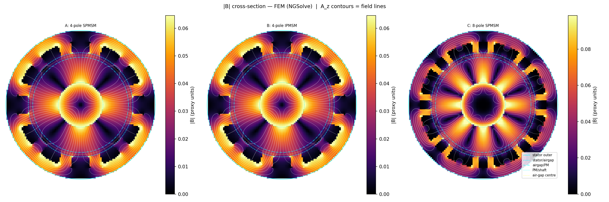
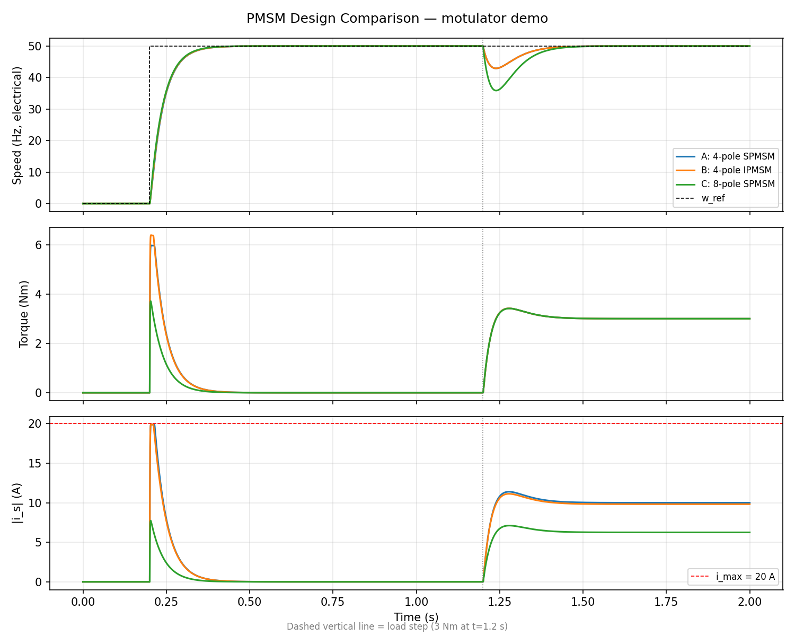

# phasesweep

PMSM simulation for stator/rotor design exploration. Built on
[motulator](https://github.com/Aalto-Electric-Drives/motulator) and
[NGSolve](https://ngsolve.org/).



## What it does

- **Drive simulation** — SPMSM and IPMSM comparison using motulator (current-vector control, mechanical load)
- **2D FEM field solver** — NGSolve magnetostatic solver with smooth-bore and slotted stator geometries, linear or nonlinear iron (Picard iteration)
- **Analytical validation** — Zhu & Howe (1993) closed-form air-gap field model for cross-checking FEM results
- **Slotted stator analysis** — OCC boolean geometry for exact arc-bounded slots, armature reaction decomposition, slot-count sweeps
- **Parameter sweeps** — explore the flux-linkage (psi_f) vs saliency-ratio (L_q/L_d) design space with crash-safe JSONL result storage
- **GPU-accelerated harmonic decomposition** — CuPy FFT on CUDA (optional, falls back to NumPy)

## Drive comparison

The demo runs three PMSM designs under the same current-vector controller
(540 V DC bus, 20 A limit, 50 Hz electrical speed reference) with a 3 Nm
load step at t = 1.2 s:

- **A: 4-pole SPMSM** — non-salient baseline (L_d = L_q = 4 mH)
- **B: 4-pole IPMSM** — saliency adds reluctance torque (L_q/L_d = 1.5), producing higher peak torque but drawing more current during acceleration
- **C: 8-pole SPMSM** — lower flux linkage (psi_f = 0.08 Wb) but higher torque-per-amp from doubled pole count, so less current under load at the cost of slower transient recovery



## Verification and validation

### Solver verification (Zhu & Howe)

The NGSolve FEM solver is verified against the Zhu & Howe (1993) closed-form
air-gap field solution. The fundamental agrees within 0.2–0.3% across all
configurations, confirming that the code solves the magnetostatic equations
correctly.

### Model validation (CREATOR benchmark)

Cross-checked against the [CREATOR](https://doi.org/10.3217/sns1d-77m43)
open-benchmark PMSM (70 W, 4-pole, 6-slot, sintered ferrite — Dhakal et
al., COMPEL 2025):

| Test | Computed | Published | Error |
|------|----------|-----------|-------|
| Back-EMF (E_0) | 47.92 V | 47.37 V | 1.2% |
| Rated torque | 0.102 Nm | 0.100 Nm | 1.9% |
| Max torque (at MTPA) | 0.159 Nm | 0.150 Nm | 5.9% |
| FEM fundamental (B_1) | 0.0200 T | 0.0200 T | 0.2% |

The model captures the fundamental accurately. Higher harmonics (5th: 1.7%
computed vs 13.2% measured) are underpredicted due to the sinusoidal
magnetization assumption — real ferrite magnets have near-rectangular
magnetization profiles that produce trapezoidal back-EMF. This is a
quantified model limitation, not a solver error.

## Slot count sensitivity

A sweep over Q = {6, 9, 12, 18, 24, 36} for a 4-pole SPMSM shows the
trade-off between winding complexity and field quality:

```
Q=6:  THD ~ 12%  (wide slots, high distortion)
Q=12: THD ~  4%  (baseline)
Q=36: THD ~  1%  (narrow slots, smoother field)
```

## Quick start

```bash
git clone https://github.com/jonelay/phase-sweep.git
cd phase-sweep
python -m venv .venv
.venv/bin/pip install -e .

# Optional: GPU support (requires CUDA 12.x)
.venv/bin/pip install -e ".[gpu]"

# Run the demo (generates 8 plots)
.venv/bin/python demo.py

# Run tests
.venv/bin/python -m pytest -v tests/
```

Or with [uv](https://docs.astral.sh/uv/):

```bash
uv venv .venv --python 3.12
uv pip install -e .
.venv/bin/python demo.py
```

## Project structure

```
phasesweep/
├── configs.py        # Motor configurations (MotorConfig TypedDict) and constants
├── sim.py            # Drive simulation, FEM orchestration, sweeps
├── plots.py          # All plotting functions
├── fem_field.py      # NGSolve 2D FEM solver + CuPy harmonic decomposition
├── sweep_types.py    # MotorSweepConfig (frozen, MD5 config_id), SweepResult
├── result_store.py   # JSONL append-only store with JSON index, crash-safe resume
├── sim_runner.py     # Subprocess runner for motulator (60s timeout)
└── fem_runner.py     # Subprocess runner for NGSolve (300s timeout)
demo.py               # Entry point — runs comparisons, sweeps, and FEM analysis
tests/                # pytest integration tests (98 tests)
data/                 # CREATOR reference data (CC BY-NC-ND 4.0)
motors/               # Motor parameter files (TOML)
```

## Dependencies

| Package | Purpose | License |
|---------|---------|---------|
| [motulator](https://github.com/Aalto-Electric-Drives/motulator) | Synchronous machine drive simulation | MIT |
| [NGSolve](https://ngsolve.org/) | 2D finite element field solver | LGPL-2.1 |
| [NumPy](https://numpy.org/) | Numerical computation | BSD-3-Clause |
| [Matplotlib](https://matplotlib.org/) | Plotting | PSF (BSD-compatible) |
| [CuPy](https://cupy.dev/) (optional) | GPU-accelerated harmonic decomposition | MIT |

## Reference data

The `data/creator_case_pmsm/` directory contains reference data from the
**CREATOR** open-benchmark PMSM (Dhakal et al., 2025), licensed under
**CC BY-NC-ND 4.0**. See [`data/creator_case_pmsm/README.md`](data/creator_case_pmsm/README.md)
for full attribution and citation info.

## License

Code is licensed under the [LGPL-2.1](LICENSE).

Reference data in `data/` is licensed under
[CC BY-NC-ND 4.0](https://creativecommons.org/licenses/by-nc-nd/4.0/) —
see the data directory README for details.
