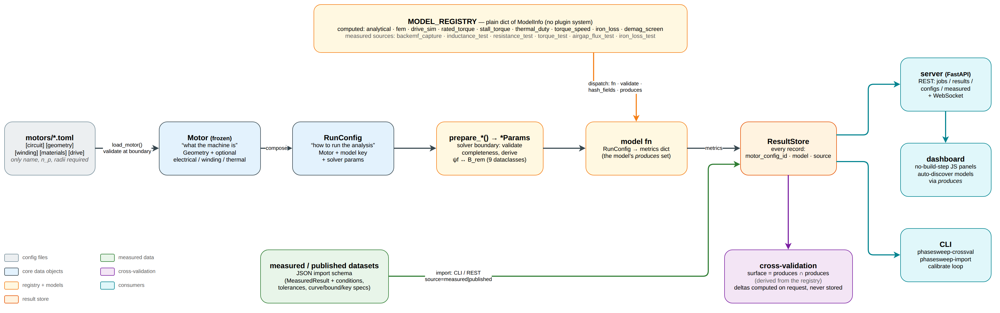
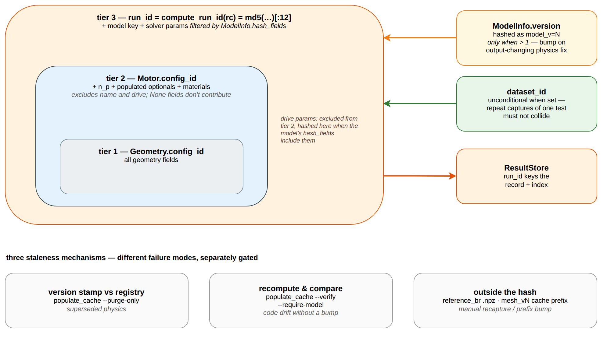
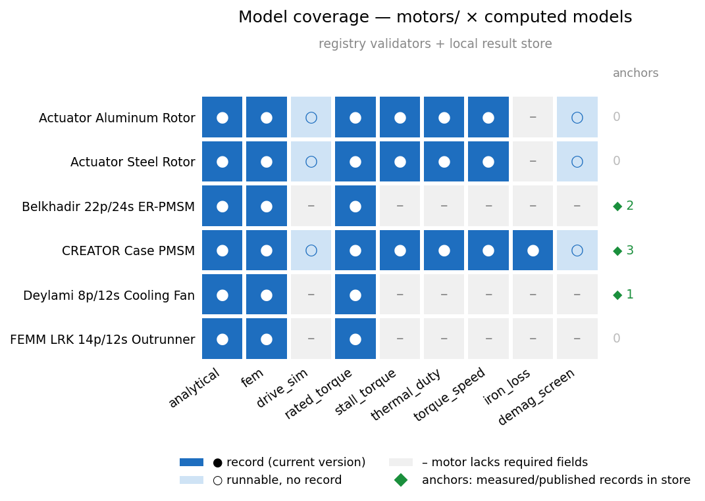

# Architecture

Three figures covering how a motor definition becomes a stored result,
how that result's identity is computed, and what the fleet currently
covers. Diagram sources live in [`diagrams/`](diagrams/); every element
that asserts a fact carries a claim-table row in
[`diagrams/README.md`](diagrams/README.md), with the repo state it was
grounded against.

## Data-flow spine



A motor TOML loads into a frozen `Motor` (validation at the boundary,
see [`motor-toml.md`](motor-toml.md)). `RunConfig` pairs that `Motor`
with a model key and solver params; the `prepare_*` factories in
`solver_params.py` validate completeness and derive `psi_f` ↔ `B_rem`,
so holding a params object means the `Motor` is ready for that solver.
`MODEL_REGISTRY` is a plain dict of `ModelInfo` — no Protocol, ABC, or
plugin system — and every model is a `RunConfig -> dict` function over
its declared `produces` quantities. Results land in the `ResultStore`
carrying `motor_config_id`, `model`, and `source`; the crossval
comparison surface is derived from `produces` intersections rather than
hardcoded, and deltas are computed on request, never stored.

The figure is a full-width landscape (3.2:1); labels are legible at
docs-page width but not at README inline width.

## Provenance and run identity



Identity is hashed in three tiers: `Geometry.config_id` over the
geometry fields, `Motor.config_id` over that plus `n_p`, populated
optionals, and materials (excluding name and drive), then
`compute_run_id` over the motor's id, the model key, and only the
solver params in that model's `hash_fields`. Two side-inputs modify the
run id — `model_v=N` when a model's version exceeds 1, and `dataset_id`
unconditionally when set, so repeat captures of one test cannot
collide.

Two staleness mechanisms sit outside the hash and need explicit
handling: version-stale records are purged by comparing the stamp
against the registry (`scripts/populate_cache.py --purge-only`), and records
written by changed code that never got a version bump are only caught
by recomputing (`scripts/populate_cache.py --verify`). Reference `.npz`
captures and the mesh-cache prefix are outside the hash entirely and
are recaptured or prefix-bumped by hand. See
[result-store-contract.md](result-store-contract.md) for the
portable specification of these rules, including test vectors for
downstream consumers.

## Model coverage



Rows are `motors/*.toml`, columns are the computed models in the
registry. Three states, one hue plus glyphs: a current-version record
in the store, runnable but no record yet, or the motor lacking fields
the model requires. The ◆ counts are measured and published records —
matched by motor *name*, not `motor_config_id`, because an imported
record pins the config id at import time and the TOML drifts past it as
it gains fields. The anchor belongs to the physical motor, not to a
config revision.

**This is a snapshot of one local store, not a project invariant.**
`output/` is gitignored, so the committed image reflects whichever
machine last rendered it. It is generated, never hand-drawn or
hand-edited:

```bash
uv run python scripts/populate_cache.py     # fill any gaps first
uv run python scripts/generate_readme_figures.py --fig 4
```

A grey cell is a statement about the motor file, not about the model:
`iron_loss` needs an `[iron]` section, `thermal_duty` and
`torque_speed` need circuit and thermal fields that the published
benchmark motors do not all carry. Light cells mean the model runs but
nothing is stored — `populate_cache.py` deliberately skips `drive_sim`
(subprocess, slow) and `demag_screen` (needs a fault current chosen per
run), so those stay light until someone runs them by hand.
