# Validation Report

Phase-sweep validates its electromagnetic models against published research,
manufacturer datasheets, and bench measurements across a fleet of motors
spanning different topologies, pole counts, and magnet grades.

## Summary

| Metric | Count |
|--------|-------|
| Reference motors (report) | 8 |
| Additional motors (test suite only) | 6 |
| Validation anchors (JSON) | see `data/` |
| Cross-validation test cases | see `tests/crossval/` |
| Quantities validated | back-EMF, airgap flux, torque, MTPA angle, Kt |
| Source types | published papers, datasheets, bench measurements |

### Cross-Validation Results

All comparisons from the automated validation report. **11 of 13** comparisons
pass within tolerance; the two partial results are explained below.

| Motor | Quantity | Computed | Reference | Error | Tol | Result | Source |
|-------|----------|---------|-----------|-------|-----|--------|--------|
| CREATOR Case PMSM | back-EMF (V) | 47.91 | 47.37 | 1.1% | 5% | PASS | TU Graz CREATOR dataset |
| CREATOR Case PMSM | MTPA angle at 0.15 A | 12.3° | 10° | 23.0% | 25% | PASS | arXiv:2501.15921 |
| CREATOR Case PMSM | MTPA angle at 0.30 A | 20.6° | 20° | 3.2% | 15% | PASS | arXiv:2501.15921 |
| CREATOR Case PMSM | rated torque (Nm) | 0.107 | ≥ 0.10 | +6.8% | bound | PASS | arXiv:2501.15921 |
| Belkhadir ER-PMSM | B_ag fundamental (T) | 1.026 | 0.963 | 6.6% | 10% | PASS | IECON 2023 |
| Belkhadir ER-PMSM | back-EMF peak (V) | 67.5 | 67.5 | 0.0% | 8% | PASS | IECON 2023 |
| Belkhadir ER-PMSM | flux linkage (Wb) | 0.097 | 0.100 | 3.0% | 30% | PASS | IECON 2023 |
| Belkhadir ER-PMSM | B_ag (FEM, T) | 1.020 | 0.963 | 5.9% | 10% | PASS | IECON 2023 |
| Belkhadir ER-PMSM | rated torque (Nm) | 25.1 | ≥ 24 | +4.5% | bound | PASS | IECON 2023 |
| Deylami Fan | B_ag peak (FEM, T) | 0.408 | 0.49 | 16.7% | 25% | PASS | TechRxiv |
| Deylami Fan | B_ag peak (analytical, T) | 0.365 | 0.49 | 25.5% | 25% | FAIL | TechRxiv |
| 14 mm Outrunner (Steel) | back-EMF (V) | 2.14 | 1.68 | 27.3% | 1% | FAIL | bench (ODrive) |

### Notes on Partial Results

**Deylami Fan analytical B_ag_peak (25.5% vs 25% tolerance):** The analytical
model slightly exceeds tolerance for this simplified slot geometry. The FEM
model passes at 16.7%. The published reference itself is from a simplified 2D
ANSYS Maxwell model, not a physical measurement — both values are
model-vs-model comparisons.

**14 mm Outrunner (Steel) back-EMF (27.3%):** The linear speed sweep (RTB2004 oscilloscope, 8 points, R² = 0.9999)
supports measurement consistency. Calibration attributes most of the
discrepancy to the nominal B_rem (1.45 T) exceeding the effective value
(~1.14 T). This motor is the framework's flagship calibration case.

## Analytical vs FEM Agreement

The analytical (Zhu & Howe subdomain) and nonlinear FEM (NGSolve Picard
iteration) solvers agree closely on the airgap flux density fundamental across
all reference motors:

| Motor | Analytical B₁ (T) | FEM B₁ (T) | Delta | Speed ratio |
|-------|-------------------|------------|-------|-------------|
| 14 mm Outrunner (Steel) | 1.004 | 0.998 | 0.5% | 14,400× |
| CREATOR Case PMSM | 0.302 | 0.302 | 0.1% | 27,900× |
| Belkhadir 22p/24s ER-PMSM | 1.026 | 1.020 | 0.6% | 69,100× |
| Deylami 8p/12s Cooling Fan | 0.453 | 0.445 | 1.7% | 88,600× |
| FEMM LRK 14p/12s | 0.950 | 0.945 | 0.6% | 20,800× |
| Zhu & Howe 8-pole inrunner | 0.565 | 0.564 | 0.2% | 4,500× |
| Zhu & Howe 8-pole outrunner | 0.552 | 0.552 | 0.0% | 4,400× |

The analytical model runs 4,400–89,000× faster than FEM while maintaining
< 3% error on the fundamental.

## Per-Motor Details

### CREATOR Case PMSM

4-pole inrunner from the TU Graz CREATOR open dataset (arXiv:2501.15921).
Validated on back-EMF, MTPA angle, and rated torque. (Iron loss excluded:
`B_core` was calibrated against the same measured loss curve — see
CHANGELOG 0.3.0.)

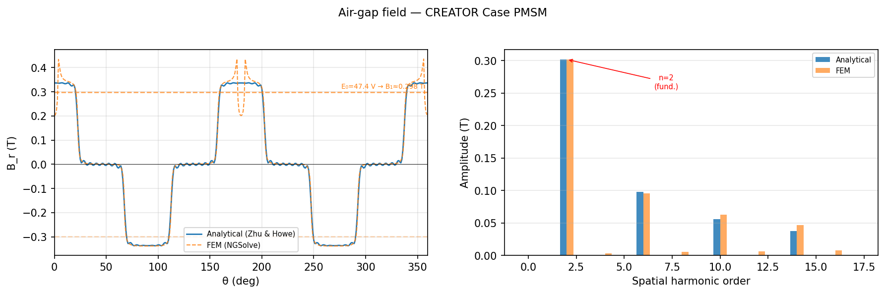

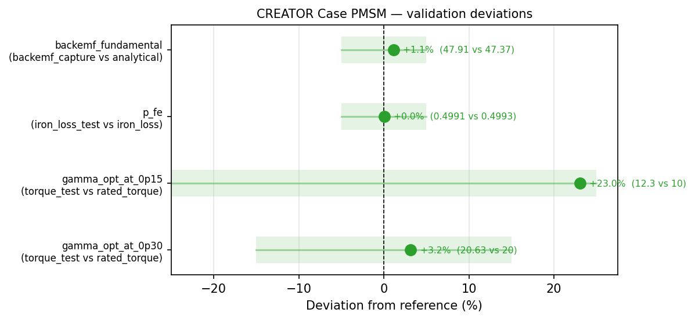

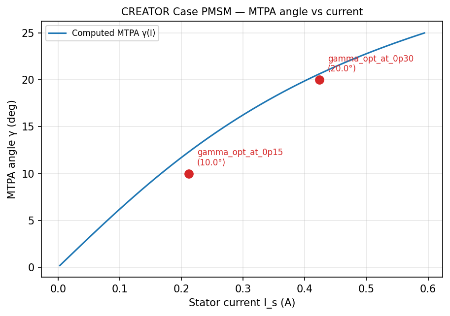

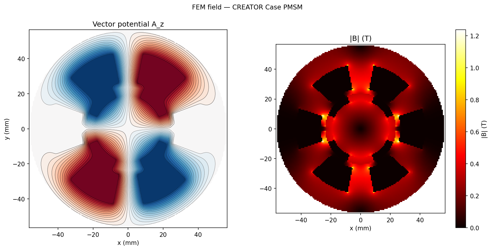

### Belkhadir 22p/24s ER-PMSM

22-pole / 24-slot external-rotor PMSM from Belkhadir et al. (IECON 2023).
Validated on airgap flux, back-EMF, flux linkage, and rated torque — all
passing within tolerance for both analytical and FEM solvers.

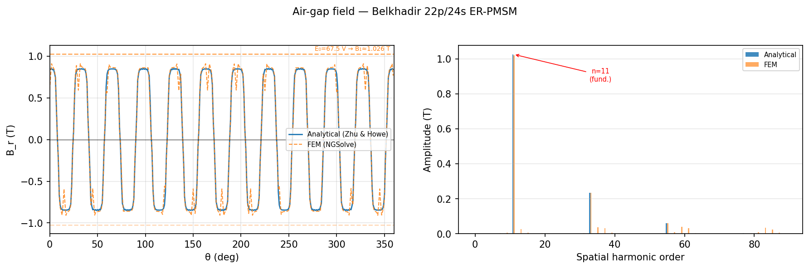

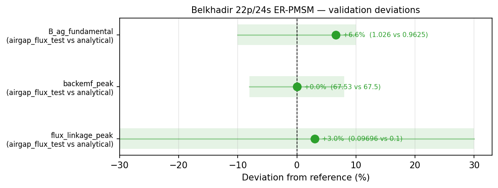

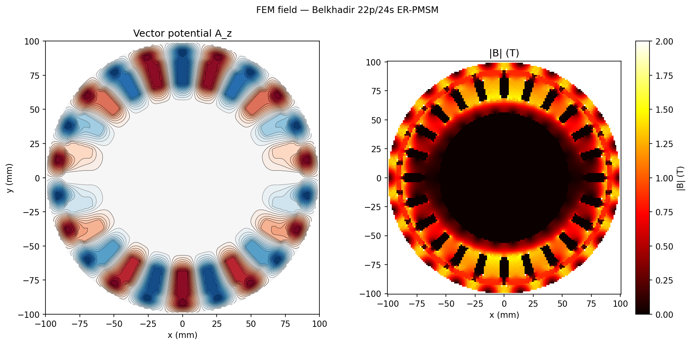

### Deylami 8p/12s Cooling Fan

8-pole / 12-slot outrunner from Deylami et al. (TechRxiv). FEM passes the
airgap flux comparison; the analytical model slightly exceeds the tolerance.

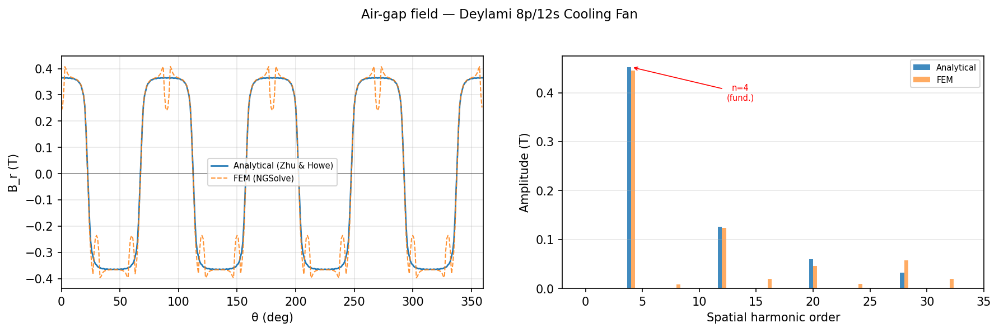

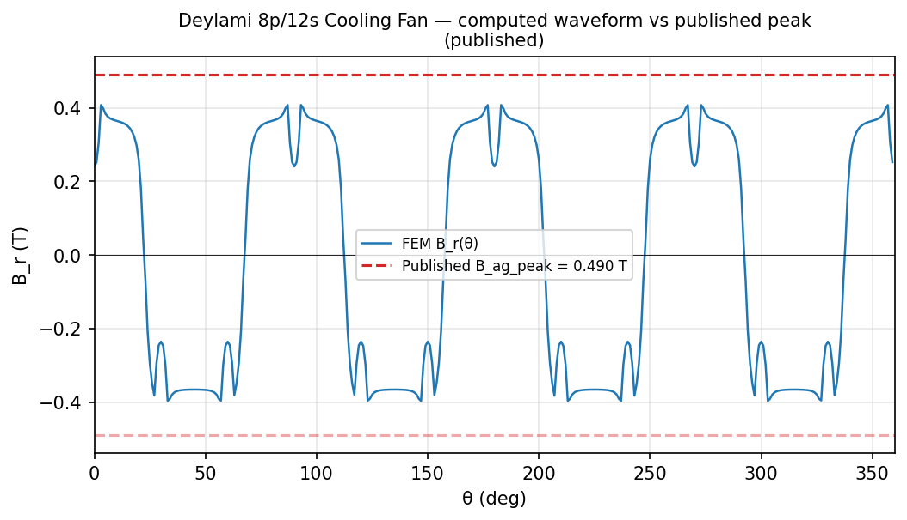

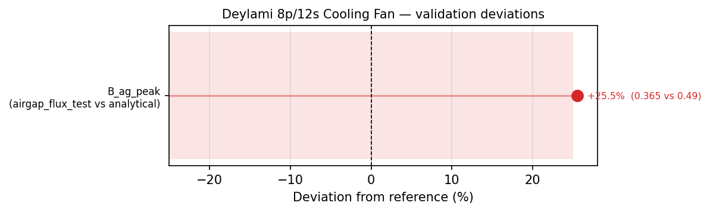

### 14 mm Outrunner (Steel)

12-pole / 9-slot outrunner (bench-measured with RTB2004 oscilloscope).
The 27% back-EMF discrepancy reflects the gap between nominal B_rem
(1.45 T) and the effective value (~1.14 T from calibration), not a
measurement error.

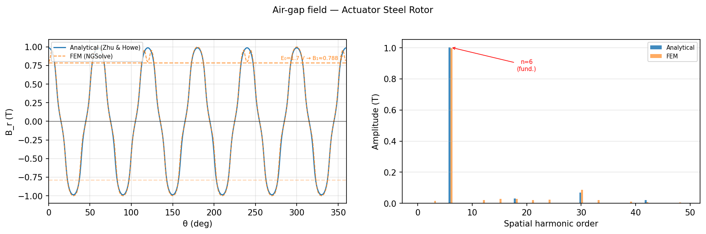

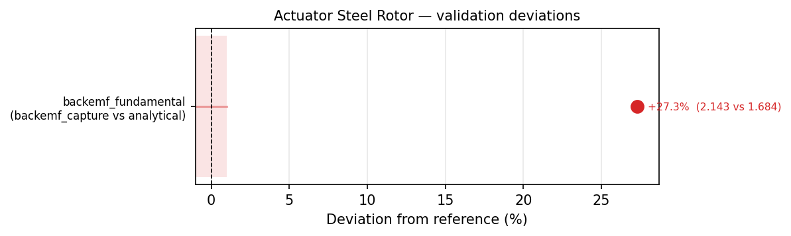

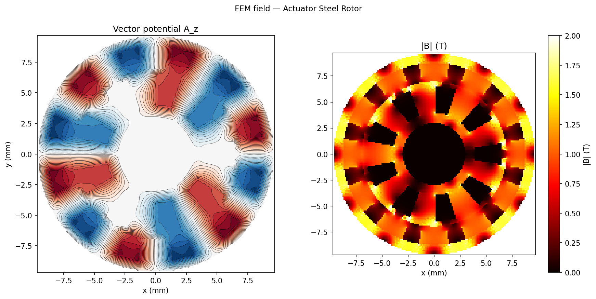

## Additional Validation Coverage

The following motors have validation anchors and cross-validation tests
(`pytest tests/crossval/`) but are not included in the report
figures above:

| Motor | Source | Quantities Tested |
|-------|--------|-------------------|
| Toyota Prius 2004 IPM | ORNL/TM-2004/185 | stall torque ≥ 340 Nm, MTPA angle |
| Awan 2.2 kW IPM | Aalto dissertation | saliency ratio, rated torque ≥ 14 Nm |
| ETEL TMB (5 sizes) | ETEL datasheet | back-EMF from Ku (5 winding variants) |
| Rexroth MS2N04 | Bosch Rexroth manual | back-EMF from KE |
| Tecnotion QTR-A-105 | Tecnotion datasheet | back-EMF from KE |
| JMT 1806 2400KV | bench measurement | back-EMF speed sweep (8 speeds) |

## How Validation Works

Each validation anchor is a JSON file in `data/<motor>/` containing a
published or measured value, its source, tolerance, and comparison method:

- **Delta**: direct percentage comparison (most quantities)
- **Bound**: inequality check — e.g., rated torque ≥ published rating
- **Curve**: extract a scalar from a computed waveform (e.g., max of B_r)
  and compare to a published value

The `phasesweep.validation.crossval` module computes deviations, applies
tolerances, and produces structured pass/fail diagnostics. The crossval
suite runs in CI on every commit.

## Reproducing This Report

```bash
pip install -e ".[all]"
uv run python scripts/validation_report.py --no-sensitivity --workers 4
```

The full report with sensitivity analysis takes approximately 45 minutes:

```bash
uv run python scripts/validation_report.py --workers 4
```

Output goes to `output/validation_report/` (gitignored).
